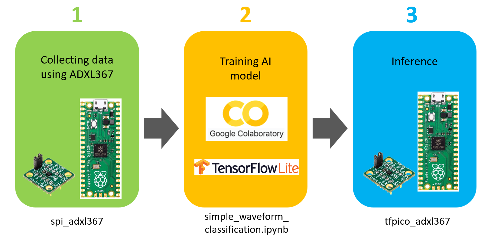
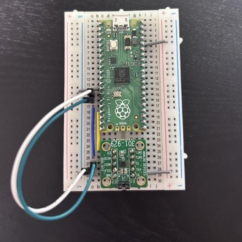

# Raspberry Pi Pico AI Gesture Inference with ADXL367
This repository demonstrates a Deep Neural Network inference model created in TensorFlow, converted to a TensorFlow Lite for Microcontrollers model, and run on a Raspberry Pi Pico. The model is designed to classify the states into clapping, rotating, and shaking based on the XYZ axis data obtained from the ADXL367 accelerometer. The training data for each state is time series data sampled at 12.5 Hz, with a window_size of 6 (0.5 sec × 12 Hz) and step_size of 1 with 75% overlap for window processing.


## Features
- Classifies gesture movement from accelerometer into clapping, rotating, and shaking
- Uses a simple neural network model implemented in TensorFlow
- Converts the model to TensorFlow Lite micro format for use on microcontrollers
- Runs inference on a Raspberry Pi Pico


## System Overall
 

### SPI Board connection
Use SPI 1  

 | pin | Pico | ADXL367 |
 | :----: | :----: | :----:  |
 |SCLK | 10    | P2_2      |
 |MOSI | 11    | P2_3      |
 |MISO | 12    | P2_4      |
 |CS   | 13    | P2_5     |  
 
 


## Build and Install
### 1. Set up Raspberry Pi Pico SDK
The most easiest way is using VScode extention.  
Follow this instruction: [ Raspberry Pi Pico Visual Studio Code extension](https://marketplace.visualstudio.com/items?itemName=raspberry-pi.raspberry-pi-pico)  
[Getting Started guide](https://datasheets.raspberrypi.com/pico/getting-started-with-pico.pdf) also helps you. 

### 2. Build the Firmware (spi_adxl367)
Build the firmware for the Raspberry Pi Pico using left side bar menue in Pico VScode extension.   
Import pfoject -> Compile project -> Run Projct (USB)  
When you Run Project, you need to change BOOTSEL mode (Insert the USB while holding down the button).


Or if the build is successful, the `spi_adxl367.uf2` firmware will be created. Drag and drop it onto the Raspberry Pi Pico running in BOOTSEL mode to install.

### 3. Getting data from ADXL367 via Pico  
You can recieve data via USB CDC and UART. Connect to the Raspberry Pi Pico using a serial terminal to see the output.  
Serial terminal is refer this: [pytool/pyserial](https://github.com/sugspi/pytools/blob/main/pyserial/serial_csv.py)  

Data format is:  
```python
['Timestamp','No','x','y','z']
```

### 4. Training model using Google Colab
Create Google Colab account and upload [simple_waveform_classification.ipynb](simple_waveform_classification.ipynb) and all your accelerometer data on Google Drive.

### 5. Build the Firmware (tfpico_adxl367)
Before you build project, you neet to convert weight file.
```bash
xxd -i model.tflite > model.h
```
Open moel.h file using VScode etc, and add 2 lines at the head and 1 lines at the end.  
Add head:
```
#ifndef MODEL_H
#define MODEL_H
```
Add end:  
```
#endif  //MODEL_H
```

## Example

### Sample Input

The input is a time series of accelerometer data sampled at 12 Hz. For example:

```python

```

### Sample Output

The output will classify the input into one of the three states:

```

```


## Acknowledgements

- [TensorFlow](https://www.tensorflow.org/)
- [TensorFlow Lite for Microcontrollers](https://www.tensorflow.org/lite/microcontrollers)
- [pico-tflmicro](https://github.com/raspberrypi/pico-tflmicro)
- [Raspberry Pi Pico](https://www.raspberrypi.com/products/raspberry-pi-pico/)
- [Raspberry Pi Pico SDK](https://github.com/raspberrypi/pico-sdk)
